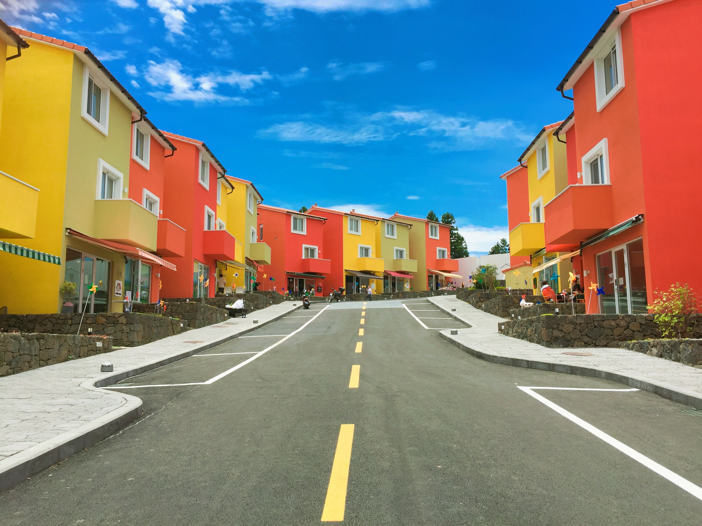

# 🎨 Color Detection

> Click anywhere on an image — instantly identify the color name and its RGB values.


---

## ✨ What It Does

A real-time desktop application that lets you **click on any pixel** in an image and immediately see:

- The **color name** (from a dataset of 865+ named colors)
- The **RGB values** of that pixel
- A **color preview bar** rendered directly on the image

---

## 📸 Demo

| pic1.jpg | pic2.jpg | pic3.jpg |
|:---:|:---:|:---:|
|  |  |  |

---

## 🗂️ Project Structure

```
color-detection/
├── Task_1_Color_Detection.ipynb   # Main Jupyter Notebook
├── colors.csv                     # Color dataset (865+ named colors)
├── pic1.jpg                       # Sample image 1
├── pic2.jpg                       # Sample image 2
├── pic3.jpg                       # Sample image 3
└── README.md
```

---

## ⚙️ How It Works

1. An image is loaded and resized to **800×600** using OpenCV.
2. A **mouse callback** listens for left-clicks on the window.
3. On click, the **BGR pixel value** is extracted and converted to RGB.
4. The RGB values are compared against every row in `colors.csv` using **Manhattan distance**:
   ```
   distance = |R - Rᵢ| + |G - Gᵢ| + |B - Bᵢ|
   ```
5. The closest match is returned as the **color name**.
6. A **colored rectangle** with the name and RGB values is drawn at the top of the image.

---

## 🚀 Getting Started

### Prerequisites

```bash
pip install opencv-python pandas
```

### Run

1. Clone this repository:
   ```bash
   git clone https://github.com/your-username/color-detection.git
   cd color-detection
   ```

2. Open the notebook:
   ```bash
   jupyter notebook Task_1_Color_Detection.ipynb
   ```

3. Update the file paths in the notebook to point to your local files:
   ```python
   IMAGE_PATH = "pic1.jpg"   # or pic2.jpg / pic3.jpg
   CSV_PATH   = "colors.csv"
   ```

4. Run all cells — an OpenCV window will open. **Click anywhere** on the image!

### Controls

| Key | Action |
|-----|--------|
| Left Click | Detect color at cursor |
| `ESC` or `Q` | Close the window |

---

## 📊 Color Dataset

`colors.csv` contains **865 named colors** with the following fields:

| Column | Description |
|--------|-------------|
| `color` | Short color code |
| `color_name` | Human-readable name |
| `hex` | Hex code (e.g. `#FF5733`) |
| `R` | Red channel (0–255) |
| `G` | Green channel (0–255) |
| `B` | Blue channel (0–255) |

---

## 🛠️ Built With

- **[OpenCV](https://opencv.org/)** — image loading, display, and mouse events
- **[Pandas](https://pandas.pydata.org/)** — color dataset management

---

## 🤝 Contributing

Pull requests are welcome! For major changes, please open an issue first to discuss what you'd like to change.

---

## 📄 License

This project is licensed under the [MIT License](LICENSE).

---

<p align="center">Made with ❤️ and a lot of colors</p>
